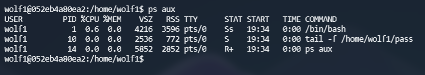
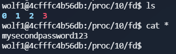
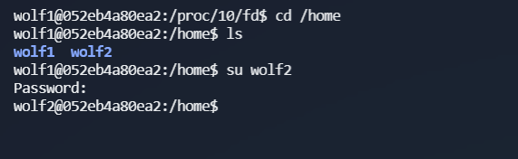
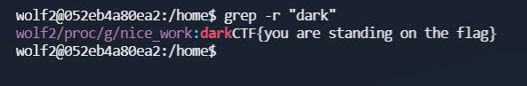
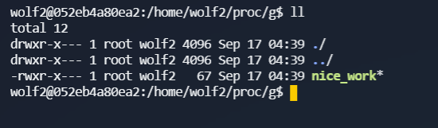
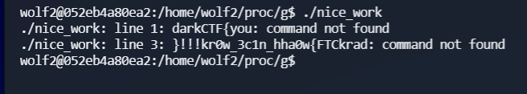

# Find me

If a running program still has a file that has has been deleted open, you can recover the file throught the open file descriptor. This is located in `proc/pid/fd`.

We see a process called pass running, lets make note of the pid and and look in proc.

We found a password. The fact that it is mysecondpassword gives us a hint that it is the password for the second user account.

Wolf2 has a lot of directories and subdirectories in the home folder. Lets see if we can grep2win.

Looks like a flag, but its not the correct one. (The spaces might be a hint) But it tells us we are stading in the right place so we are close. 

Looking at the file nice_work,it is an exectuable, so lets run it.

There's our flag backwards. 

darkCTF{w0ahh_n1c3_w0rk!!!}