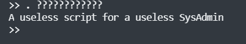

### JailBoss

Taking a look at the provided bash script:

The -v flag for grep inverts the match. So it looks like the only characters we can use are . / ? a and space. 

Trying just inputting a, it dispalys envoirnmental variables.

What else can we do? . is the source operator, so we can use that to execute files

The only things left are / and ?. Doing some research, ? in bash is a wildcard operator. * is the more well known wildcard operator, and represents any number of characters. For example ls *.txt will show all files that end in txt. ? represents a single character, so ls ???.txt will only show txt files with 3 character names.

Looking back at the challenge description, we see that there is a script called taskFword.sh. Lets try to exectute it.

It seems like it didnt do anything. But, looking back at our envoirnment again, we see the flag

Not so useless after all!

FwordCTF{BasH_1S_R3aLLy_4w3s0m3_K4hLaFTW}

