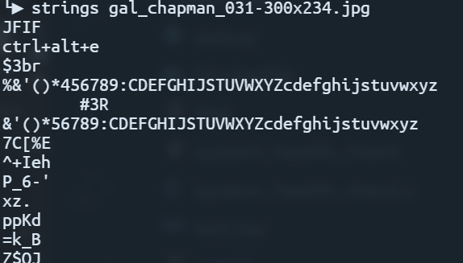

### Busted

We are given an image file. The first things I tried was to run strings on the file to see if anything turn up.

ctrl+alt+e stood out to me. I tried googling it but couldnt figure out what it represented. After trying a few different things, I guessed that it might be the password for steghide (the category for the challenge is steganography after all)

Trying `steghide --extract -sf gal_chapman_031-300x234.jpg -p ctrl+alt+e` gets us the flag!

flag{compress_embedded_data}