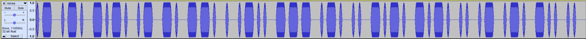

### Chess Cheater

We are given a file morse.wav. Listening to it, it is to fast to understand, but opening the file with audactiy we can easily make out each character. 

Which gives us our flag 
flag{arcangeloricciardi}

Arcangelo Ricciardi was caught cheating in a tournament using morse code.

