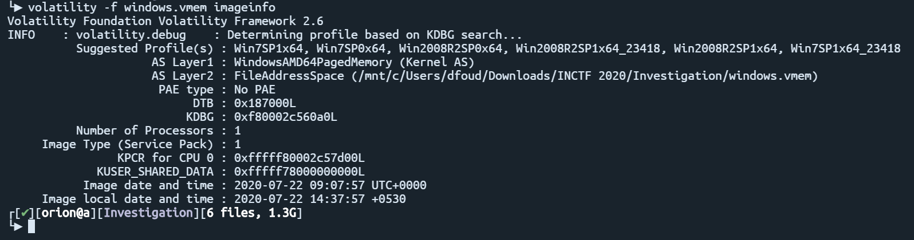
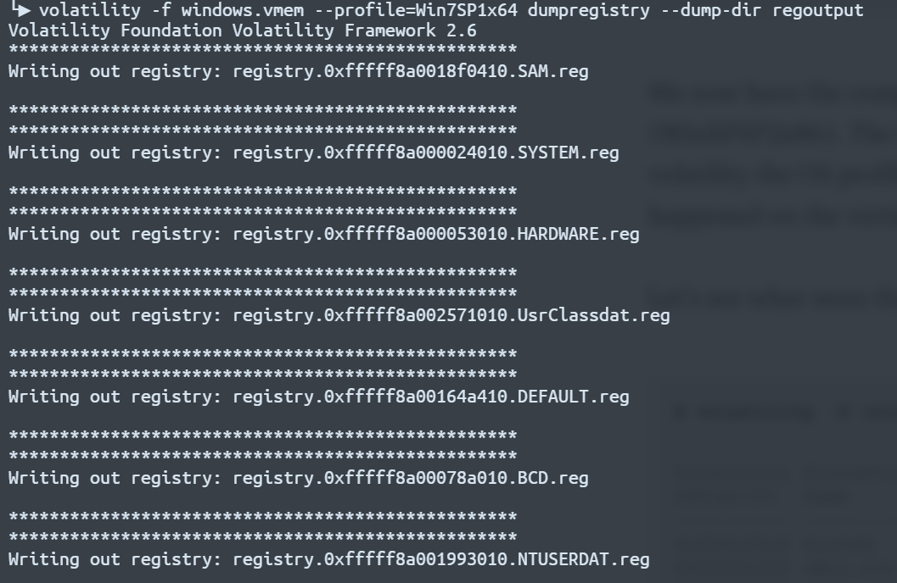
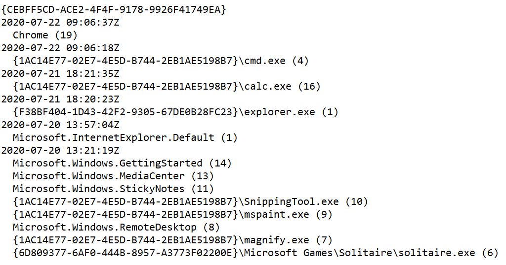

# Investigation

We are given a vmem file and asked to find two things.
1. When did Adam last use the Windows Calcualtor
2. How many times did Adam use Google Chrome in this sytem?

Using volatilty, we first run imageinfo to get more information about the memory dump.

Now that we have the right profile, we can see what information we can get. The most likely place to find usage stats is in the registery, using dumpregistry

It took me a good amount of time to figure out how to find the information we want in the registry. The number of times a program has been run is stored in the user registy at `[HKEY_CURRENT_USER\Software\Microsoft\Windows\CurrentVersion\Explorer\UserAssist]`. When I was searching for chrome nothing was coming up, but it turns out the path is stored in ROT13. So chrome becomes puebzr.
Using grep, we see the information we want is in the file registry.0xfffff8a00256d010.ntuserdat.reg. But we still need to find a way to read the file. I found a program called regripper (https://github.com/keydet89/RegRipper3.0) that will extract the info from the registery file. Running it on the file, we get the info we want.

Looks like chrome has been run 19 times, and the last time the calculator was run was on the 21st. Putting these together, we get our flag

inctf{21-07-2020_18:21:35_19}