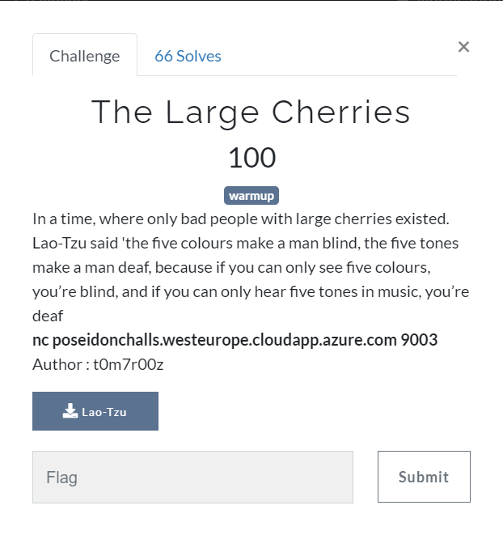
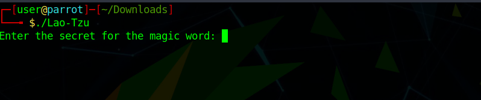
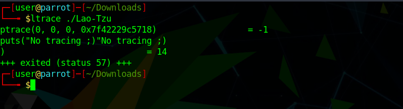
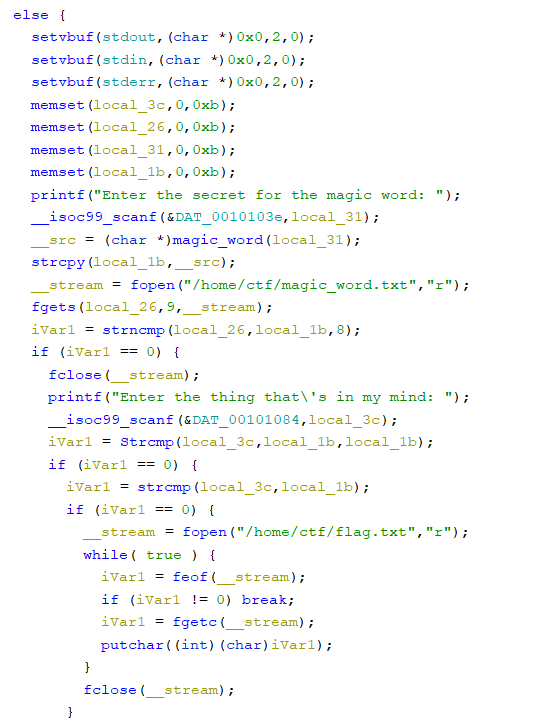
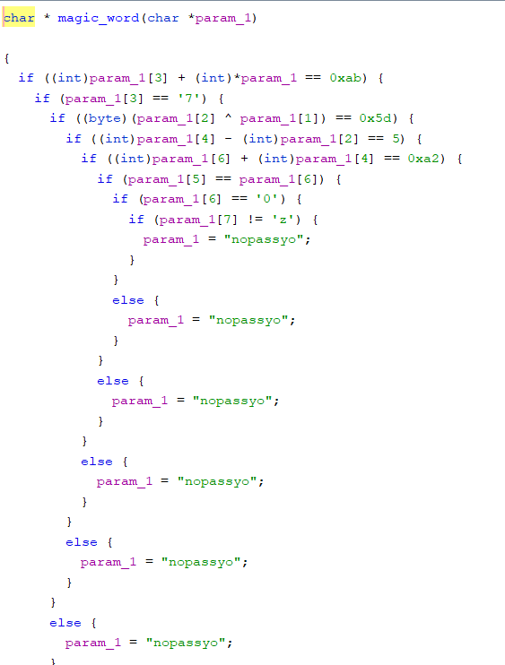
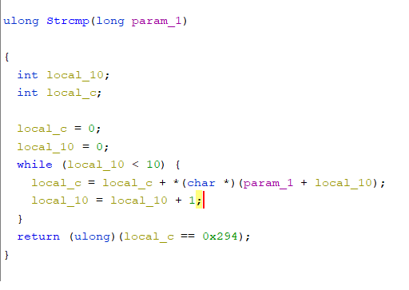
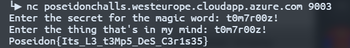

### The Large Cherries



Running the binary, we are prompted for a password



The first thing I tried was ltrace, but that didn't quite work.



No problem, time to fire up Ghidra and take a look inside. Taking a look at our main function:



There are two passwords needed to get the flag. For the first one, the function magic_word is called:



This function checks that the string is equal to the challenge authors name, t0m7r00z. The second part is a bit tricker. First the function Strcmp is called.



Strcmp iterates through the input string and sums the value of each of the characters. It then checks if that value is equal to 294 hex.

```c 
iVar1 = Strcmp(local_3c,local_1b,local_1b);
if (iVar1 == 0) ... 
```
We need Strcmp to return false, so sum of the chars in our string cannot be 294.

 Summing up the ascii values in t0m7r00z gets us 294 hex which is 660 decimal (116 + 48 + 109 + 55 + 114 + 48 + 48 + 122). So the second password cannot be t0m7r00z. However, our next if statment checks to see that the second input is equal to the first!

```c 
iVar1 = strcmp(local_3c,local_1b);
if (iVar1 == 0) ...
```
This time we use strcmp, which returns 0 if two strings are equal. So our second password must be equal to the first, but cannot be t0m7r00z. What is going on here? The trick is that our first compare uses strncmp and only checks the first 8 characters of our input!

```c 
iVar1 = strncmp(local_26,local_1b,8);
```

The second compare makes sure our entire string doesn't add up to 294. And the third compare just makes sure the two strings are equal. So, the simple solution is just to add a character to the end of t0m7r00z, which gets us our flag.



